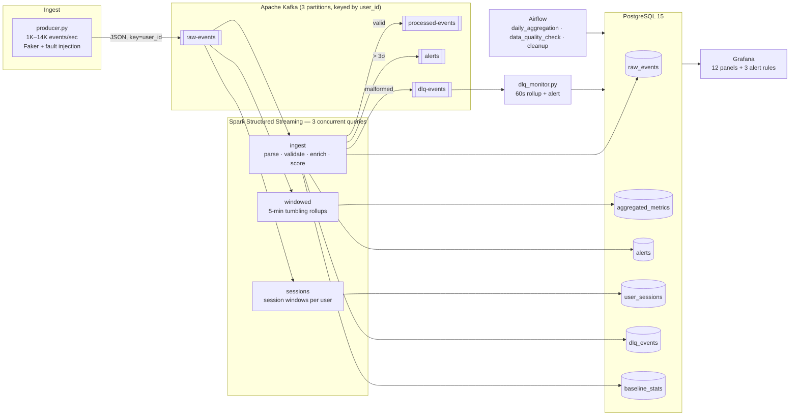

# StreamPulse — Real-Time Streaming Analytics Pipeline

A production-shaped streaming pipeline: **Kafka → Spark Structured Streaming → PostgreSQL → Grafana**,
orchestrated by **Airflow**, with a dead letter queue, real-time anomaly detection and idempotent writes.

One command starts everything:

```bash
docker compose up -d --build
```

| Service | URL | Credentials |
|---|---|---|
| Kafka UI | http://localhost:8080 | — |
| Grafana | http://localhost:3000 | `admin` / `admin` |
| Airflow | http://localhost:8081 | `admin` / `admin` |
| Spark UI | http://localhost:4040 | — |

---

## Architecture



**Kappa, not Lambda.** There is exactly one code path for events: the stream. The Airflow DAGs do not
recompute the stream's output from raw data — they roll *the stream's own output* up into daily facts and
enforce retention. That is the distinction that matters in an interview: a Lambda architecture maintains two
implementations of the same business logic (batch and speed layers) and has to keep them in agreement;
Kappa keeps one, and reprocesses by replaying the log.

---

## Quick start

```bash
git clone https://github.com/your-handle/StreamPulse.git
cd StreamPulse
cp .env.example .env          # optional: everything has sane defaults

docker compose up -d --build  # ~3 minutes on a cold cache
make smoke                    # live counters straight from PostgreSQL
```

Then open Grafana at http://localhost:3000 → **StreamPulse / Live Pipeline**. Events appear within ~30 s.

```bash
make logs      # tail producer + consumer + DLQ monitor
make lag       # Kafka offsets and Spark micro-batch progress
make psql      # SQL shell
make topics    # topic configuration
make clean     # stop everything and delete the volumes
```

**Requirements:** Docker Desktop with ~6 GB allocated. Nothing else — Java, Spark, Kafka and Python all live
inside the images.
