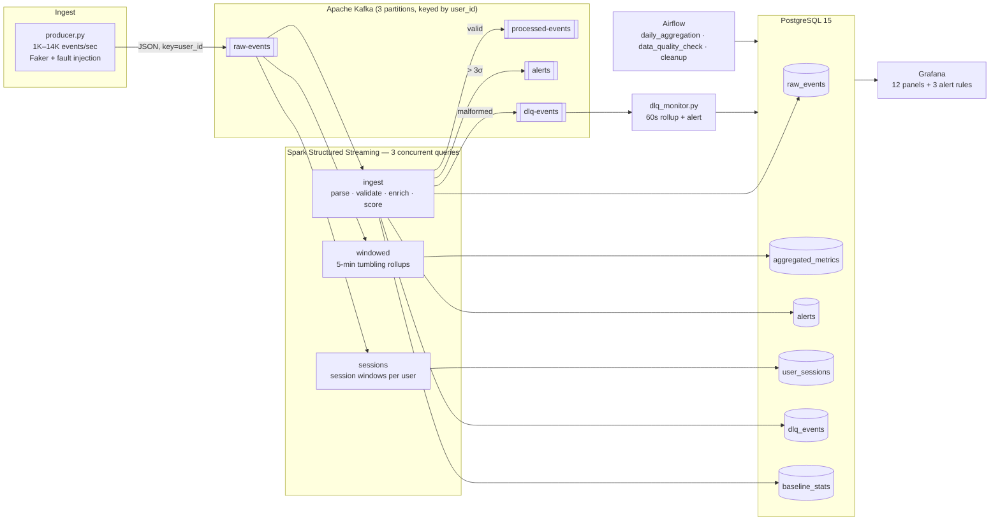

# StreamPulse — Real-Time Streaming Analytics Pipeline

A production-shaped streaming pipeline: **Kafka → Spark Structured Streaming → PostgreSQL → Grafana**,
orchestrated by **Airflow**, with a dead letter queue, real-time anomaly detection and idempotent writes.

One command starts everything:

```bash
docker compose up -d --build
```

| Service | URL | Credentials |
|---|---|---|
| Kafka UI | http://localhost:8080 | — |
| Grafana | http://localhost:3000 | `admin` / `admin` |
| Airflow | http://localhost:8081 | `admin` / `admin` |
| Spark UI | http://localhost:4040 | — |

---

## Architecture



**Kappa, not Lambda.** There is exactly one code path for events: the stream. The Airflow DAGs do not
recompute the stream's output from raw data — they roll *the stream's own output* up into daily facts and
enforce retention. That is the distinction that matters in an interview: a Lambda architecture maintains two
implementations of the same business logic (batch and speed layers) and has to keep them in agreement;
Kappa keeps one, and reprocesses by replaying the log.

---

## Quick start

```bash
git clone https://github.com/your-handle/StreamPulse.git
cd StreamPulse
cp .env.example .env          # optional: everything has sane defaults

docker compose up -d --build  # ~3 minutes on a cold cache
make smoke                    # live counters straight from PostgreSQL
```

Then open Grafana at http://localhost:3000 → **StreamPulse / Live Pipeline**. Events appear within ~30 s.

```bash
make logs      # tail producer + consumer + DLQ monitor
make lag       # Kafka offsets and Spark micro-batch progress
make psql      # SQL shell
make topics    # topic configuration
make clean     # stop everything and delete the volumes
```

**Requirements:** Docker Desktop with ~6 GB allocated. Nothing else — Java, Spark, Kafka and Python all live
inside the images.

---

## Data model

Full DDL in [`sql/schema.sql`](sql/schema.sql); the event contract is in
[`schema_registry.md`](schema_registry.md).

| Table | Grain | Written by | Conflict policy |
|---|---|---|---|
| `raw_events` | one row per event | `ingest` | `ON CONFLICT (event_id) DO NOTHING` |
| `aggregated_metrics` | (window, event_type) | `windowed` | `DO UPDATE` — windows are revised as late data arrives |
| `alerts` | (event_id, alert_type) | `ingest` | `DO UPDATE` |
| `user_sessions` | (user_id, session_start) | `sessions` | `DO UPDATE` |
| `dlq_events` | (source_partition, source_offset) | `ingest` | `DO NOTHING` — the Kafka coordinate is the natural key |
| `baseline_stats` | event_type | `ingest` | `DO UPDATE` with **additive** merge |
| `batch_log` | (query_name, batch_id) | all three | `DO UPDATE` |
| `data_quality_results` | — | Airflow | — |
| `analytics.*` | see [dbt](#analytics-layer-dbt) | dbt | rebuilt / `delete+insert` |

**Why upserts instead of `df.write.jdbc()`.** Spark's JDBC writer only appends or overwrites. Kafka gives
at-least-once delivery, and a micro-batch that fails after writing but before committing its offsets *will*
be replayed. Appending would duplicate those rows. Every sink in [`consumer/sinks.py`](consumer/sinks.py)
therefore uses `INSERT … ON CONFLICT` through `execute_values`, executed with `foreachPartition` so each
executor writes its own partition in one batched round trip. At-least-once delivery plus idempotent storage
gives **effectively-once** results, which is what actually matters — and it is far cheaper than Kafka
transactions.

The `uniqueness` check in the data quality DAG exists specifically to prove this: after 1.9 M events and a
full load-test replay, **0 duplicate `event_id`s**.
